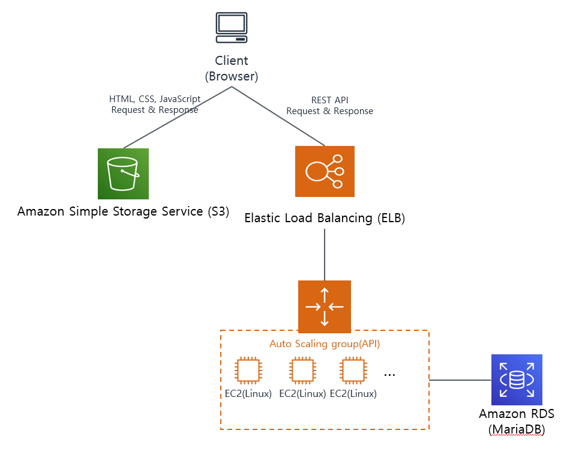

# cafe-schedule

## 프로젝트 설계
#### 사용 언어
* FrontEnd: VueJS(Javscript/HTML, SPA)
* BackEnd: Codeigniter(PHP)
* DB: MariaDB
#### DB 테이블 구조
```
-- -----------------------------------------------------
-- Table `cafe_schedule`.`t_course`
-- -----------------------------------------------------
CREATE TABLE IF NOT EXISTS `cafe_schedule`.`t_course` (
  `no` INT UNSIGNED NOT NULL AUTO_INCREMENT COMMENT 'idx',
  `name` VARCHAR(30) NOT NULL COMMENT '과목 이름',
  `color` char(6) NOT NULL COMMENT '표시될 컬러(16진수 6자리)',
  `point` SMALLINT NOT NULL DEFAULT '1' COMMENT '학점',
  PRIMARY KEY (`no`)
)ENGINE = InnoDB COMMENT = '과목 테이블';

-- -----------------------------------------------------
-- Table `cafe_schedule`.`t_course`
-- -----------------------------------------------------
CREATE TABLE IF NOT EXISTS `cafe_schedule`.`t_course_time` (
  `no` INT unsigned NOT NULL AUTO_INCREMENT COMMENT 'idx',
  `course_no` INT unsigned NOT NULL COMMENT '과목 idx',
  `parent_course_time_no` INT unsigned DEFAULT NULL COMMENT '3학점의 두번째 수업일 경우 첫번째 수업의 idx 입력',
  `start_time` SMALLINT NOT NULL COMMENT '과목 시작 시간',
  PRIMARY KEY (`no`),
  CONSTRAINT `fk_t_course_t_course_time_course_no`
    FOREIGN KEY (`course_no`)
    REFERENCES `t_course` (`no`)
    ON DELETE NO ACTION
    ON UPDATE NO ACTION,
  CONSTRAINT `fk_t_course_time_t_course_time_parent_course_time_no`
   FOREIGN KEY (`parent_course_time_no`)
   REFERENCES `t_course_time` (`no`)
   ON DELETE NO ACTION
   ON UPDATE NO ACTION
)ENGINE = InnoDB COMMENT = '과목별 사용 수업 시간';

```
#### 서비스 아키텍처


## 대규모 서비스에 대한 대응
* 데이터 조회이외에 모든 로직은 프론트에서 진행합니다(API처리 최소화)
* VUEX를 이용해 과목리스트를 별도로 저장하여 페이지 로드 후 최초 1회만 과목 리스트를 로드합니다
* 프론트엔드는 AWS S3저장소에서 정적 웹호스팅 사용(API 서버와 별도로 구성, 사용횟수만큼 금액 지불)
* API서버는 AWS에서 Loard Balancer와 AutoScaling Group을 이용해 고가용성을 높이고 서버를 사용량에 따라 유동적으로 Scale Up, Scale Out 됩니다

## Pseudo Code(의사 코드)
* 재귀함수를 이용한 모든 경우의 수 행
* 경우의수 마지막 단계 입력 이후 호출하여 선택된 시간표에 중복값  & 제외 시킬 시간 비교
* 중복값이나 제외시킬 시간이 없는 경우 결과값 입력

#### Code
```
// // 결과 리스트
let aResult = []

combination(0, [])

// 선택한 과목들에 대한 시간표 자동생성 함수(시간 중복 제거 포함)
function combination(iSelectIndex, aPreResult) {
  // 선택된 과목 수 만큼 재귀 호출 후 결과값 검증
  if ( iSelectIndex == self.aSelectCourseIndexList.length ) {
    // 중복된 시간이 제거된 시간 리스트
    let aTimeList = []
    // 전체 시간 수(1시간당 1씩증가)
    let iTimeTotalCount = 0

    for ( const iKey in aPreResult ) {
      // 과목별 선택된 시간 조회
      let aTime = self.aCourseList[self.aSelectCourseIndexList[iKey]].oCourseTimeDataList[aPreResult[iKey]]

      for ( const iTimeKey in aTime ) {
        // 시간 중복 체크 및 제외 시간 체크
        if (aTimeList.indexOf(aTime[iTimeKey]) == -1 && self.aSelectExclude.indexOf(aTime[iTimeKey]) < 0) aTimeList.push(aTime[iTimeKey])
      }

      // 과목별 학점에 따라 전체 시간 값 추가 (3학점: 4시간, 1,2학점: 2시간)
      iTimeTotalCount += self.aCourseList[self.aSelectCourseIndexList[iKey]].iPoint === 3 ? 4 : 2
    }

    // 전체 시간 수와 중복이 제거된 시간의 수가 같을 경우만 결과값에 시간표 결과값 추가
    if ( iTimeTotalCount == aTimeList.length ) aResult.push(aPreResult)
  } else {  // 선택한 과목이 다 돌때까지 combination 함수 재귀호출
    // 선택된 과목에대한 시간 리스트
    const oCourseTimeDataList = self.aCourseList[self.aSelectCourseIndexList[iSelectIndex]].oCourseTimeDataList

    for ( const iKey in oCourseTimeDataList ) {
      combination(
        (iSelectIndex + 1),
        [].concat(aPreResult, [iKey])
      )
    } // End for
  } // End if
} // End combination function
```
